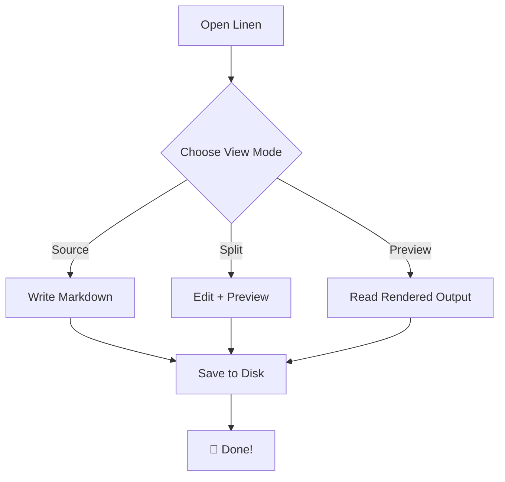
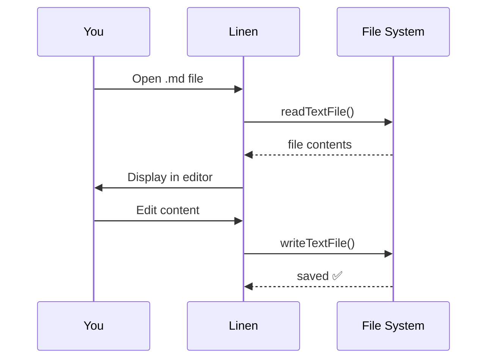

<p align="center">
  
</p>

<h1 align="center">Welcome to Linen 🤍</h1>

---

## Getting Started

Linen lets you write and preview Markdown with **real-time rendering**, **Mermaid diagrams**, **syntax highlighting**, and **multiple tabs**. Everything stays on your machine — no cloud, no accounts.

## View Modes

Press `Ctrl+Shift+V` to cycle through modes, or click the toolbar buttons:

| Icon      | Mode        | Description                                                                             |
| --------- | ----------- | --------------------------------------------------------------------------------------- |
| &lt;/&gt; | **Source**  | Edit raw Markdown in a full-width code editor                                           |
| ║         | **Split**   | Source editor (left) + live preview (right)                                             |
| 📖        | **Preview** | Full-width rendered output — click **Edit** or press `Ctrl+E` to unlock WYSIWYG editing |

> **Pro tip**: In Split or Preview mode, click the **Edit** button (or press `Ctrl+E`) to unlock the preview pane for rich-text WYSIWYG editing with a formatting toolbar. If your document contains HTML tags, a warning will appear — raw HTML can be altered in WYSIWYG mode.

---

## Keyboard Shortcuts

| Shortcut         | Action                                        |
| ---------------- | --------------------------------------------- |
| `Ctrl+S`         | Save current file                             |
| `Ctrl+O`         | Open a `.md` file                             |
| `Ctrl+N`         | New untitled tab                              |
| `Ctrl+W`         | Close current tab                             |
| `Ctrl+Tab`       | Next tab                                      |
| `Ctrl+Shift+Tab` | Previous tab                                  |
| `Ctrl+B`         | Toggle sidebar                                |
| `Ctrl+F`         | Find & Replace (with match case + whole word) |
| `Ctrl+Shift+V`   | Cycle view modes (Source → Split → Preview)   |
| `Ctrl+E`         | Toggle Edit / Lock in the preview pane        |

---

## Markdown Features

### Text Formatting

**Bold**, _italic_, ~~strikethrough~~, `inline code`

### Headings

# Heading 1

## Heading 2

### Heading 3

### Lists

- Unordered item
- Another item
  - Nested item

1. First ordered item
2. Second ordered item

### Task Lists

- [x] Completed task
- [x] Install Linen
- [ ] Deploy to GitHub Releases

### Blockquotes

> The best time to plant a tree was 20 years ago.
> The second best time is now.

### Links

Links open in your default browser (with a confirmation dialog):

[Linen on GitHub](https://github.com/marsaariqi/linen)

### Images

You can paste images from your clipboard or insert them via URL:


### Tables

| Feature               | Supported |
| --------------------- | --------- |
| Syntax Highlighting   | ✅        |
| Mermaid Diagrams      | ✅        |
| Multi-tab Editing     | ✅        |
| Dark Mode + Cat Theme | ✅        |
| Find & Replace        | ✅        |
| Image Paste           | ✅        |

### Code Blocks

**JavaScript**

```javascript
function greet(name) {
	console.log(`Hello, ${name}!`);
}
greet("World");
```

**Python**

```python
def fibonacci(n):
    a, b = 0, 1
    for _ in range(n):
        yield a
        a, b = b, a + b
```

**Rust**

```rust
fn main() {
    println!("Linen is built with Tauri + Rust!");
}
```

---

## Mermaid Diagrams

Embed diagrams directly in your Markdown:





---

## Themes

Linen includes three themes — change them in **Settings**:

| Theme     | Vibe                          |
| --------- | ----------------------------- |
| **Light** | Clean, bright, classic        |
| **Dark**  | Low-light friendly, modern    |
| **Cat**   | Deep purple + pink accents 🐱 |

---

## Tips

- **Sidebar**: Toggle with `Ctrl+B` to see your document outline — click any heading to jump straight to it.
- **Tabs**: Create new tabs with `Ctrl+N`, close with `Ctrl+W`, and switch with `Ctrl+Tab` / `Ctrl+Shift+Tab`. Right-click any tab for context actions — close, close others, or reveal the file in Explorer.
- **Find & Replace**: `Ctrl+F` opens the search bar. Toggle match case and whole word. Replace works in all editable modes.
- **WYSIWYG Editing**: Unlock the preview with `Ctrl+E` to edit with a rich-text toolbar. If your document has HTML tags, a warning will appear — HTML may be altered in WYSIWYG mode.
- **Auto-save**: Your session is saved automatically and restored when you reopen Linen.
- **Open App Folder**: Go to _Settings → Open App Folder_ to find where Linen stores your data.

---

_Happy writing! ✍️_
