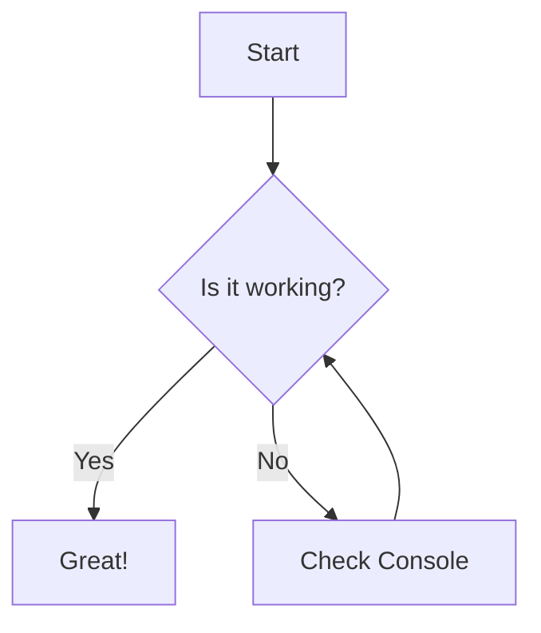

# Linen Editor Capability Test Suite

This document is designed to stress-test the rendering, editing, and navigation capabilities of the Linen Markdown editor.

## 📑 Table of Contents
1. [Basic Text & Formatting](#basic-text--formatting)
2. [Headings & Hierarchy](#headings--hierarchy)
3. [Lists & Task Items](#lists--task-items)
4. [Links, References & Images](#links-references--images)
5. [Blockquotes & Nesting](#blockquotes--nesting)
6. [Tables](#tables)
7. [Code Blocks](#code-blocks)
8. [Raw HTML Integration](#raw-html-integration)
9. [Mathematical Expressions (LaTeX)](#mathematical-expressions-latex)
10. [Mermaid Diagrams](#mermaid-diagrams)
11. [Edge Cases & Stress Tests](#edge-cases--stress-tests)
12. [Footnotes](#footnotes)
13. [Conclusion](#conclusion)

---

## Basic Text & Formatting

**Bold Text** and __Bold Text__
*Italic Text* and _Italic Text_
***Bold & Italic***
~~Strikethrough~~
`Inline Code`
Subscript: H~2~O (Chemical formula for water)
Superscript: E = mc^2^ (Einstein's equation)

---

## Headings & Hierarchy

# Header 1
## Header 2
### Header 3
#### Header 4
##### Header 5
###### Header 6

---

## Lists & Task Items

### Unordered List
- Item 1
- Item 2
  - Sub-item 2.1
  - Sub-item 2.2
    - Deeply nested item
- Item 3

### Ordered List
1. First item
2. Second item
3. Third item
   1. Nested item A
   2. Nested item B

### Task List
- [x] Finished task
- [ ] Unfinished task
- [ ] Task with *italics*
- [x] Task with ~~strikethrough~~

---

## Links, References & Images

[Linen GitHub Repository](https://github.com/example/linen)


---

## Blockquotes & Nesting

> This is a single line blockquote.
>
> > This is a nested blockquote.
>
> "The only way to do great work is to love what you do." — Steve Jobs

---

## Tables

| Feature | Support | Performance | Notes |
| :--- | :---: | :---: | :--- |
| Markdown | High | Fast | Core functionality |
| Mermaid | Medium | Variable | Requires rendering |
| LaTeX | Medium | Variable | MathJax/KaTeX |
| Tables | High | Fast | Standard GFM |

---

## Code Blocks

### JavaScript
```javascript
function helloWorld() {
  const message = "Hello, Linen!";
  console.log(message);
}
```

### Rust
```rust
fn main() {
    println!("Linen is fast!");
}
```

---

## Raw HTML Integration

<div style="background-color: #f0f0f0; padding: 20px; border-radius: 8px; border: 1px solid #ccc;">
  <h4 style="color: #2c3e50; margin-top: 0;">Native HTML Block</h4>
  <p>This is rendered inside a <code>div</code> with inline styles.</p>
  <button onclick="alert('XSS Blocked!')">Click Me (Sanitization Test)</button>
</div>

<details>
  <summary>Click to expand additional info</summary>
  <p>This content was hidden behind a details tag. Useful for FAQs or long logs.</p>
</details>

---

## Mathematical Expressions (LaTeX)

### Inline LaTeX
The Pythagorean theorem is $a^2 + b^2 = c^2$.

### Block LaTeX
$$
I = \int_{0}^{\infty} e^{-x^2} dx = \frac{\sqrt{\pi}}{2}
$$

---

## Mermaid Diagrams



---

## Edge Cases & Stress Tests

Linen should handle large files without lag. Below is a repetitive block to increase file size.

Lorem ipsum dolor sit amet, consectetur adipiscing elit. Sed do eiusmod tempor incididunt ut labore et dolore magna aliqua. Ut enim ad minim veniam, quis nostrud exercitation ullamco laboris nisi ut aliquip ex ea commodo consequat.

Duis aute irure dolor in reprehenderit in voluptate velit esse cillum dolore eu fugiat nulla pariatur. Excepteur sint occaecat cupidatat non proident, sunt in culpa qui officia deserunt mollit anim id est laborum.

Lorem ipsum dolor sit amet, consectetur adipiscing elit. Sed do eiusmod tempor incididunt ut labore et dolore magna aliqua. Ut enim ad minim veniam, quis nostrud exercitation ullamco laboris nisi ut aliquip ex ea commodo consequat.

Duis aute irure dolor in reprehenderit in voluptate velit esse cillum dolore eu fugiat nulla pariatur. Excepteur sint occaecat cupidatat non proident, sunt in culpa qui officia deserunt mollit anim id est laborum.

---

## Footnotes

Here is a simple footnote[^1]. With another one[^2].

[^1]: This is the first footnote.
[^2]: This is the second footnote, which is slightly longer to see how it wraps.

---

## Conclusion

Linen is ready for production-level Markdown editing.

[Back to Top](#linen-editor-capability-test-suite)
